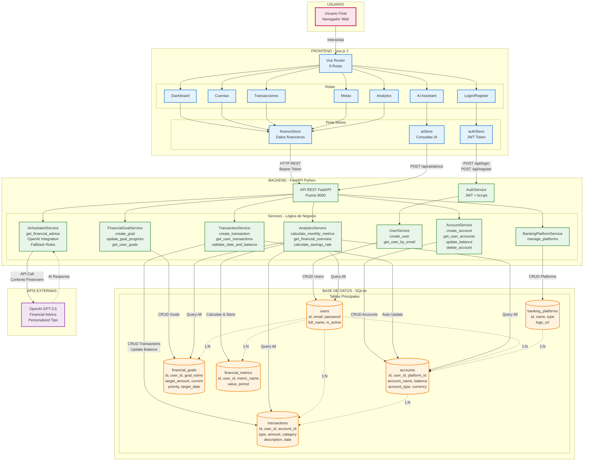

# Diagrama Completo - FinanceApp

## Arquitectura y Flujo Completo del Sistema



---

## Componentes del Sistema

### Frontend (Vue.js 3)
- **8 Vistas:** Login, Register, Dashboard, Cuentas, Transacciones, Metas, Analytics, AI Assistant
- **3 Stores (Pinia):** authStore (autenticación), financeStore (datos), aiStore (IA)
- **Tecnologías:** Vue Router, Axios, TailwindCSS, Vite

### Backend (FastAPI Python)
- **7 Servicios principales:**
  1. **UserService** - Gestión de usuarios y registro
  2. **AccountService** - CRUD de cuentas bancarias
  3. **TransactionService** - Ingresos, gastos, transferencias
  4. **FinancialGoalService** - Metas financieras con progreso
  5. **AnalyticsService** - Métricas y dashboard
  6. **AIAssistantService** - Asesoría con OpenAI/Reglas
  7. **BankingPlatformService** - Catálogo de plataformas

### Base de Datos (SQLite)
- **6 Tablas:**
  - `users` - Usuarios del sistema
  - `accounts` - Cuentas bancarias (checking, savings, credit, investment)
  - `transactions` - Movimientos financieros (income, expense, transfer)
  - `financial_goals` - Metas con tracking de progreso
  - `financial_metrics` - Métricas calculadas históricas
  - `banking_platforms` - Bancos y plataformas digitales

### APIs Externas
- **OpenAI GPT-3.5:** Asesoría financiera personalizada
- **Fallback:** Sistema basado en reglas si no hay API key

---

## Flujos Principales

### 1. Autenticación
```
Usuario → Login Form → POST /api/login → AuthService
→ Verify password (bcrypt) → Generate JWT Token
→ Return Token → Store in authStore → Access granted
```

### 2. Crear Transacción
```
Usuario → Transaction Form → POST /api/transactions
→ Validate: date ≤ NOW, amount > 0, user owns account
→ IF EXPENSE: Check balance ≥ amount
→ Create transaction in DB
→ Auto update account.balance (± amount)
→ Return success → Update UI
```

### 3. Dashboard Financiero
```
Usuario → Dashboard → GET /api/analytics/overview
→ AnalyticsService.get_financial_overview()
→ Query: accounts, transactions, goals
→ Calculate: total_balance, monthly_income, monthly_expenses, savings_rate
→ Return FinancialOverview → Display in UI
```

### 4. Consulta Asistente IA
```
Usuario → AI Assistant → POST /api/ai/advice
→ Get user financial context (overview)
→ IF OpenAI Key exists:
    → Call GPT-3.5 with context → AI Response (confidence: 0.95)
→ ELSE:
    → Rule-based system → Generated Response (confidence: 0.85)
→ Generate recommendations (savings, budget, goals)
→ Return AIResponse → Display advice
```

---

## Funcionalidades Clave

### Validaciones Automáticas
- Transacciones: fecha no futura, saldo suficiente
- Cuentas: usuario propietario, plataforma existe
- Metas: target amount > 0, fecha futura
- Autenticación: JWT válido en cada request

### Actualizaciones Automáticas
- Balance de cuenta al crear transacción
- Métricas mensuales al calcular analytics
- Last_updated timestamp en cambios

### Cálculos Financieros
- Savings Rate = ((income - expenses) / income) × 100
- Goal Progress = (current_amount / target_amount) × 100
- Monthly Metrics por período de fechas

---

## Seguridad

- **Autenticación JWT** (HS256, 30 min expiration)
- **Password Hashing** con bcrypt
- **CORS** configurado para desarrollo
- **Validación de Ownership** en cada operación
- **Bearer Token** en todas las rutas protegidas

---

## Tecnologías

| Capa | Tecnología | Descripción |
|------|-----------|-------------|
| Frontend | Vue.js 3 + Vite | SPA reactivo con HMR |
| State | Pinia | State management moderno |
| Styling | TailwindCSS | Utility-first CSS |
| Backend | FastAPI | Python async framework |
| ORM | SQLAlchemy | Database abstraction |
| Validation | Pydantic | Type validation |
| Auth | JWT + bcrypt | Token-based auth |
| Database | SQLite | Embedded database |
| IA | OpenAI API | GPT-3.5-turbo |

---

## Estadísticas del Sistema

- **Endpoints API:** 18+
- **Servicios:** 7
- **Modelos:** 15+ Pydantic + 6 ORM
- **Vistas Frontend:** 8
- **Stores:** 4
- **Tablas DB:** 6
- **Relaciones:** 8 Foreign Keys

